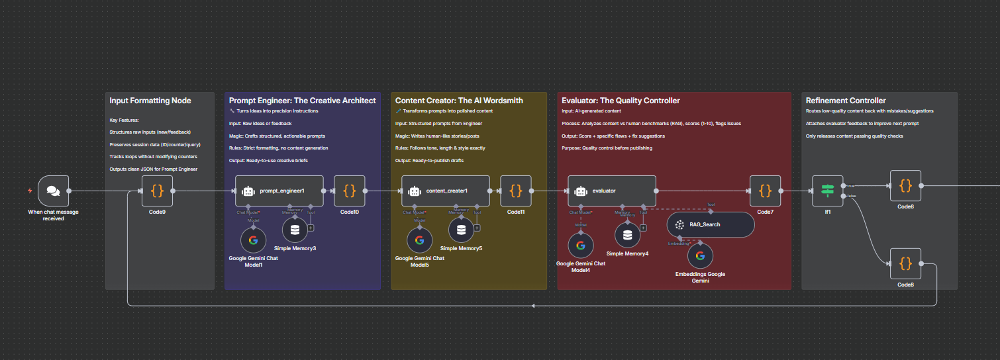
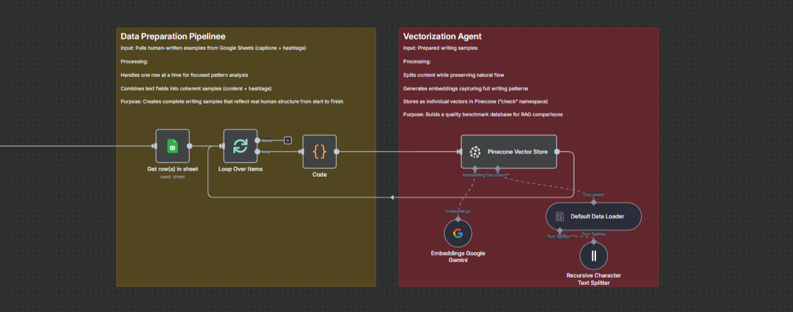

# AI Content Refinement System 🤖

A **5-agent n8n pipeline** that takes raw ideas and produces publication-ready content — automatically. No human review needed unless the quality score falls below threshold.

Built to solve a real problem: AI-generated content is fast but inconsistent. This system makes it both fast *and* reliable by running every output through evaluation against human-written benchmarks before it ever reaches a user.

---

## The Pipeline



Five agents run in sequence, each with a specific role:

| Agent | Role | What it actually does |
|---|---|---|
| **Input Formatting Node** | Structures raw input | Parses new ideas vs feedback, preserves session data, outputs clean JSON |
| **Prompt Engineer** | The Creative Architect | Transforms raw ideas into structured, actionable creative briefs |
| **Content Creator** | The AI Wordsmith | Writes human-like posts following tone, length, and style exactly |
| **Evaluator** | The Quality Controller | Scores output 1–10 against RAG-retrieved human benchmarks, flags specific flaws |
| **Refinement Controller** | The Gatekeeper | Routes low-scoring content back with improvement notes; only releases content that passes |

---

## Architecture

```
User Input (idea or feedback)
        ↓
Input Formatting Node
(structures input, tracks session)
        ↓
Prompt Engineer  ←──────────────────┐
(crafts creative brief)             │
        ↓                           │
Content Creator                     │
(generates content)                 │
        ↓                           │
Evaluator                           │
(RAG search → score + flaws)        │
        ↓                           │
Refinement Controller               │
    ↓           ↓                   │
 Pass         Fail ─────────────────┘
  ↓         (loop with feedback)
Final Output
```

---

## Vector DB / Evaluator Pipeline

Human-written content examples are embedded and stored in Pinecone — this is the benchmark the Evaluator uses to score AI-generated output. The pipeline pulls writing samples from Google Sheets, generates embeddings via Gemini, and stores them as vectors.



---

## What Makes This Different

Most LLM content pipelines are one-shot: prompt → output → done. This system adds:

- **RAG-based evaluation** — scores against real human-written examples stored in Pinecone, not just LLM self-assessment
- **Structured feedback loops** — failed content gets specific, targeted improvement notes, not random regeneration
- **Session memory** — each agent retains context across the loop so tone and intent stay consistent
- **Quality gate** — content only exits the pipeline when it meets the benchmark

---

## Results

- Reduced human review time by **40%**
- Consistent publication-ready output across content types
- Evaluation scores improved by **2–3 points** after one feedback loop on average

---

## Tech Stack

| Layer | Technology |
|---|---|
| Workflow Engine | n8n |
| LLMs | Google Gemini |
| Vector Store | Pinecone |
| Memory | Simple Memory (per agent) |
| Data Source | Google Sheets |
| Trigger | n8n Chat interface |

---

## Repo Structure

```
ai-content-refinement/
├── README.md
├── screenshots/
│   ├── main_workflow.png
│   └── vec_DB.png
└── workflows/
    ├── Content_creator_Evaluator.json
    └── VEC_DB_evaluator.json
```

---

## How to Use

1. Import both JSONs from `workflows/` into n8n
2. Add credentials: Gemini API key, Pinecone API key
3. Populate your Pinecone index using `VEC_DB_evaluator.json` — point it at a Google Sheet with human-written examples
4. Activate `Content_creator_Evaluator.json`
5. Open the chat trigger and send a content idea
6. Receive publication-ready output

---

## Author

**Ahmad Hassan** — AI & Data Engineer
[LinkedIn](https://www.linkedin.com/in/ahmadhassan08/) · [Email](mailto:contactahmad.ds@gmail.com)
